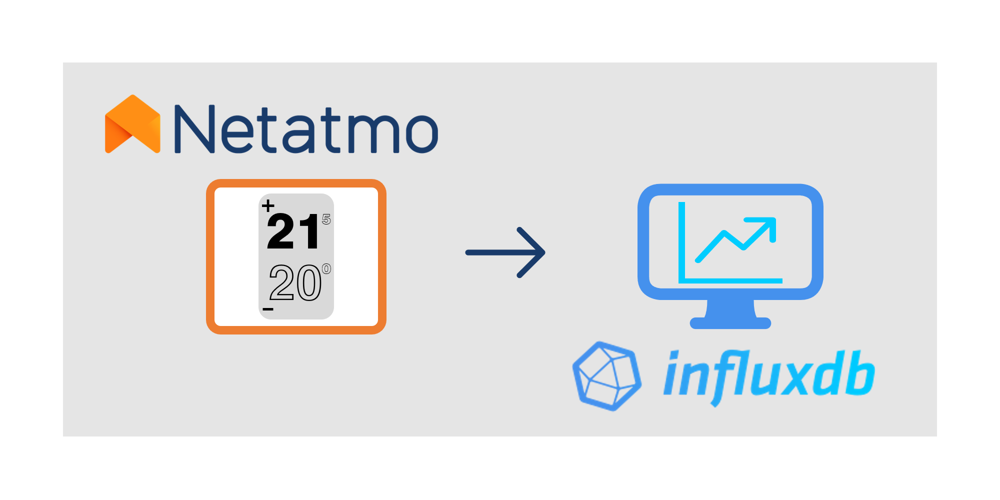

# netatmo-therm-to-influxdb
Get temperature value from your NetAtmo Thermostat and write it on InfluxDB2 server.



I have no relation with the Netatmo company, I wrote this because I needed it myself, and published it to save time to anyone who would have same needs.

This repository contains the code to be able to run a Docker container that connects to your Netatmo Thermostat device, obtains the measured temperature and desired temperature values from time to time, and stores them asynchronously on an InbluxDB 2 server. 

I would like to specify that _I am Not a developer_ as I do it all for hobby as is my passion and in my little free time.

## Information you need to provide before you start ##

### You need docker to build and run the container ###

You can get docker from here: https://docs.docker.com/get-docker/

### You need a Netatmo Themostate device and a Netatmo account ###

You need to have a Netatmo thermostat installed and working properly. In addition, you will need the following associated information: 
 - The **username** (email) and **password** you use to access the Netatmo application or the web https://my.netatmo.com/app/energy .
 - The **Client ID** and **Client Secret** of your Netatmo App. If you don't have this information yet, go to dev.netatmo.com and create a new App by completing this form: https://dev.netatmo.com/apps/createanapp#form
- The **Home ID** of your Netatmo thermostat. If you don't know it, you can search for it from this link https://dev.netatmo.com/apidocumentation/energy#homesdata
  - Click on the Try it out button
  - Choose NATherm1 from the drop-down menu under "Filter by Gateway Type".
  - Press the EXECUTE / HOMESDATA button
  - Look for the Home ID in the Server response area. The ID is the characters after
`
    {
  body: {
  homes: [
  {
  id: 
`
 - the cadence (in seconds) with which you want to consult the Netatmo thermostat and store its value in the InfluxDB database. For example, an acceptable value is 15. If this value is lowered too much, the Netatmo API query limit may be reached. 

### You need a InfluxDB server to record data ###

You need to have access to an InfluxDB 2 server, if you want, you can configure a docker container from the official image in Docker HUB (https://hub.docker.com/_/influxdb) in its version 2.0.4. In addition, you will need the following associated information:
 - The **FQDN** (IP or DNS domain, and port) of your InfluxDB server. If you have used docker to create your InfluxDB server, you can use the following command to check the server's ip:
   - GNU/Linux: `docker inspect -f '{{range .NetworkSettings.Networks}} {{. IPAddress}} {{end}}' container_name_or_id`
   - Windows: `docker inspect -f "{{range .NetworkSettings.Networks}} {{. IPAddress}} {{end}}" container_name_or_id`
   - By default, the port used by InfluxDB is 8086.
 - The name of the **organization** that will be used in InfluxDB. You can create a new organization, for example: MyOrg
 - The name of the **bucket** that will be used in InfluxDB. You can create a new bucket, for example: MyBucket
 - Access **token** for reading/writing in the bucket. If you don't have one, you can create a new token from the InfluxDB GUI: 
   > Data -> Tokens -> + Generate -> Read/Write Token -> Save 
 - The name of the measure in your InfluxDB database. For example, you can use this: temperature
 - The name of a label that we want to assign to our measure. For example you can use this: location
 - The value of the tag that we defined earlier. For example, you can use the name of your city or your street. 

## How to start ##

1. Clone this repo: `git clone https://github.com/leandroteleco/netatmo-therm-to-influxdb`
2. Build the docker: `docker build -t netatmo-therm-to-influxdb .`
3. Run the docker:
 - With full command: `docker run -it -e INFLUX_ORG=MyOrg -e INFLUX_BUCKET=MyBucket -e INFLUX_TOKEN=MyInfluxDB-Write/Read-Token -e INFLUX_URL=http://172.7.0.2:8086 -e INFLUX_MEASUREMENT=temperature -e INFLUX_TAG_NAME_1=location -e INFLUX_TAG_VALUE_1=myStreet_Location -e NETATMO_CLIENT_ID=000_My_Netatmo_Client_ID_000 -e NETATMO_CLIENT_SECRET=000_My_Netatmo_Client_Secret_000 -e NETATMO_USERNAME=myNetatmoEmail -e NETATMO_PASSWORD=myNetatmoPassword -e NETATMO_HOME_ID=000_My_Netatmo_Home_ID_000 -e NETATMO_QUERRY_CADENCE=15 -d netatmo-therm-to-influxdb`
 - With a file with environment variables and command:
   - Write a file (you can name it whatever you want, but I suggest ".env") with all environment variables:

```
INFLUX_ORG=MyOrg  
INFLUX_BUCKET=MyBucket  
INFLUX_TOKEN=MyInfluxDB-Write/Read-Token  
INFLUX_URL=http://172.7.0.2:8086  
INFLUX_MEASUREMENT=temperature  
INFLUX_TAG_NAME_1=location  
INFLUX_TAG_VALUE_1=myStreet_Location  
NETATMO_CLIENT_ID=000_My_Netatmo_Client_ID_000  
NETATMO_CLIENT_SECRET=000_My_Netatmo_Client_Secret_000  
NETATMO_USERNAME=myNetatmoEmail  
NETATMO_PASSWORD=myNetatmoPassword  
NETATMO_HOME_ID=000_My_Netatmo_Home_ID_000  
NETATMO_QUERRY_CADENCE=15  
```

   - Run the docker with this command: `docker run -it --env-file .env -d netatmo-therm-to-influxdb`
